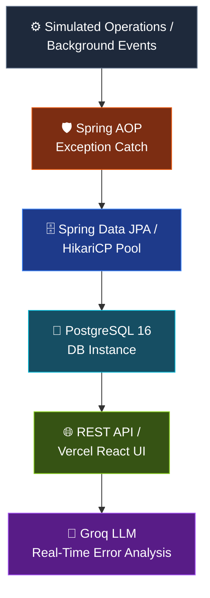

<div align="center">

# 📡 LogPulse
### Telemetry & AI-Powered Log Analyzer

**Cloud-native observability platform that turns raw exceptions into instant, plain-English root-cause diagnoses.**

[](https://openjdk.org/projects/jdk/17/)
[](https://spring.io/projects/spring-boot)
[](https://www.postgresql.org/)
[](https://nextjs.org/)
[](https://groq.com/)
[](LICENSE)

[**🚀 Live Dashboard**](https://log-analyzer-brown.vercel.app/) · [**⚡ Live API**](https://logpulse-api.onrender.com/api/logs) · [**💻 Source Code**](https://github.com/milind2411/log-analyzer) · [**🐛 Report a Bug**](https://github.com/milind2411/log-analyzer/issues)

</div>

---

## 📖 Table of Contents

- [Overview](#-system-overview--live-dashboard)
- [The Problem & Vision](#-the-problem--vision)
- [Tech Stack](#️-complete-tech-stack--architecture)
- [Architecture Flow](#-architecture-flow)
- [Engineering Challenges Solved](#-real-world-engineering--bottlenecks-solved)
- [Use Cases](#-key-use-cases--applications)
- [Getting Started](#-getting-started)
- [Roadmap](#-planned-future-enhancements)
- [Contributing](#-contributing)
- [License & Maintainer](#-license--maintainer)

---

## 📸 System Overview & Live Dashboard

<div align="center">

</div>

<br/>

<table>
<tr>
<td width="50%" valign="top">

**🔴 Real-time Warning Banners**
Prominently surfaces live system alerts, e.g. `ACTIVE WARNING: Slow query detected: runtime > 450ms`

**📊 Ingestion Metrics**
Live tracking of persisted log volume — **8,200+ logs ingested** into PostgreSQL 16

</td>
<td width="50%" valign="top">

**🛡️ AOP Interception Status**
Global exception guarding indicator — `Active & Guarding`

**🧠 Groq AI Diagnosis Panel**
Health summaries, root-cause diagnoses, and recommended actions from live stack traces

</td>
</tr>
</table>

| Resource | Link |
|---|---|
| 📱 Live Application Dashboard | [log-analyzer-brown.vercel.app](https://log-analyzer-brown.vercel.app/) |
| ⚡ Live API Endpoint | [logpulse-api.onrender.com/api/logs](https://logpulse-api.onrender.com/api/logs) |
| 💻 GitHub Repository | [github.com/milind2411/log-analyzer](https://github.com/milind2411/log-analyzer) |
| 🏷️ Current Version | `v1.0.0` |

---

## 🎯 The Problem & Vision

Debugging microservices in production often means sifting through thousands of unstructured log lines across cloud environments. Identifying critical failures — database pool exhaustion, slow SQL queries, third-party rate limits — eats into valuable incident response time.

**LogPulse** solves this by:

1. **Standardizing** log ingestion and streaming across severity levels (`INFO`, `WARN`, `ERROR`)
2. **Automatically intercepting** runtime exceptions without polluting business logic
3. **Leveraging high-performance LLM inference** (Groq API) to translate backend stack traces into plain-English root causes and action plans

---

## 🛠️ Complete Tech Stack & Architecture

<details open>
<summary><b>Backend Framework & Core</b></summary>
<br/>

| Component | Technology |
|---|---|
| Language | Java 17 (LTS) |
| Framework | Spring Boot 3.x |
| Persistence Layer | Spring Data JPA / Hibernate |
| Aspect-Oriented Logic | Spring AOP (Exception Interception) |
| Connection Management | HikariCP Connection Pool |

</details>

<details>
<summary><b>Database & Search</b></summary>
<br/>

| Component | Technology |
|---|---|
| Engine | PostgreSQL 16 (hosted on Render) |
| Optimization | Custom composite indexing on `timestamp` and `severity` fields |

</details>

<details>
<summary><b>Frontend & UI</b></summary>
<br/>

| Component | Technology |
|---|---|
| Framework | React / Next.js |
| Styling | Tailwind CSS (dark-themed dashboard) |
| Hosting | Vercel |

</details>

<details>
<summary><b>AI Diagnostics Engine</b></summary>
<br/>

| Component | Technology |
|---|---|
| API | Groq LLM Inference API (Llama 3 model) |

</details>

<details>
<summary><b>DevOps & Infrastructure</b></summary>
<br/>

| Component | Technology |
|---|---|
| Containerization | Multi-stage Dockerfile (JRE Alpine runtime) |
| Deployment | Render Web Service |
| Version Control | Git / GitHub (`v1.0.0`) |

</details>

---

## 🔄 Architecture Flow



<details>
<summary><b>📋 Step-by-step breakdown</b></summary>
<br/>

1. **Telemetry Ingestion** — Background services emit application events (`INFO`, `WARN`, `ERROR`)
2. **Aspect-Oriented Exception Interception** — Custom `@Aspect` handlers intercept unhandled runtime exceptions globally, format the message payload and stack trace, and prepare telemetry for persistence
3. **Database Persistence** — Events are written to PostgreSQL 16 via Spring Data JPA, using HikariCP connection pooling
4. **Live Visualization** — A responsive React frontend polls REST API endpoints to display log feeds, severity badges, and persistence metrics
5. **LLM Diagnostic Engine** — One-click AI analysis sends active error payloads to the Groq API, producing an instant **Health Summary**, **Root Cause Diagnosis**, and **Recommended Action Plan**

</details>

---

## 💥 Real-World Engineering & Bottlenecks Solved

Building for `localhost` differs heavily from deploying to cloud infrastructure. During cloud deployment on Render, LogPulse hit real production bottlenecks under load:

<details>
<summary><b>1️⃣ HikariCP Connection Pool Exhaustion</b></summary>
<br/>

**Issue:** Concurrent background writes caused `CannotCreateTransactionException` and `Connection refused on port 5432` errors.

**Fix:** Reconfigured HikariCP parameters to ensure connection reuse and prevent starvation:

```properties
maximum-pool-size=10
connection-timeout=20000
idle-timeout=300000
```

</details>

<details>
<summary><b>2️⃣ Database Query Bottlenecks</b></summary>
<br/>

**Issue:** Log read queries on large telemetry volumes caused execution delays (`>450ms`).

**Fix:** Created composite JPA indexes across high-frequency lookup columns (`timestamp`, `severity`), cutting query times significantly.

</details>

<details>
<summary><b>3️⃣ Third-Party Rate Limit Handlers</b></summary>
<br/>

**Issue:** Rapid AI diagnostic triggers caused HTTP `429 Too Many Requests` responses from external APIs.

**Fix:** Implemented graceful error handling and request throttling logic on the backend.

</details>

---

## 💡 Key Use Cases & Applications

| Use Case | Description |
|---|---|
| 🚨 **Production Incident Response** | Converts unhandled exceptions into instant diagnosis reports for faster MTTR (Mean Time to Resolution) |
| 🔭 **Microservice Observability** | Centralized log viewing and automated error trapping for Java applications |
| 🧪 **Developer Staging & Testing** | Instant feedback on simulated runtime faults during integration testing |

---

## 🚀 Getting Started

<details>
<summary><b>Prerequisites</b></summary>
<br/>

- Java 17 (LTS)
- Maven or Gradle
- PostgreSQL 16
- Node.js (for the frontend)
- A Groq API key

</details>

<details>
<summary><b>Backend Setup</b></summary>
<br/>

```bash
# Clone the repository
git clone https://github.com/milind2411/log-analyzer.git
cd log-analyzer/backend

# Configure environment variables
cp .env.example .env
# Set DB credentials, GROQ_API_KEY, etc.

# Run the Spring Boot application
./mvnw spring-boot:run
```

</details>

<details>
<summary><b>Frontend Setup</b></summary>
<br/>

```bash
cd log-analyzer/frontend

npm install
npm run dev
```

</details>

<details>
<summary><b>Docker (Recommended)</b></summary>
<br/>

```bash
docker build -t logpulse-api .
docker run -p 8080:8080 --env-file .env logpulse-api
```

</details>

> ⚠️ Adjust setup steps above to match the actual scripts in your repo — replace placeholders with real commands/paths as needed.

---

## 🔮 Planned Future Enhancements

- [ ] **Automated Alerting** — Slack, Discord, and Webhook integrations for high-severity `ERROR` spikes
- [ ] **Distributed Search** — Elasticsearch / OpenSearch integration for full-text regex querying
- [ ] **Metrics & Telemetry Visuals** — Time-series charts tracking memory usage and error velocity
- [ ] **Authentication & Security** — OAuth2 / JWT login for multi-tenant developer access control

---

## 🤝 Contributing

Contributions, issues, and feature requests are welcome!

1. Fork the project
2. Create your feature branch (`git checkout -b feature/AmazingFeature`)
3. Commit your changes (`git commit -m 'Add some AmazingFeature'`)
4. Push to the branch (`git push origin feature/AmazingFeature`)
5. Open a Pull Request

---

## 📄 License & Maintainer

<div align="center">

Developed and maintained by **[Milind](https://github.com/milind2411)**

Distributed under the **MIT License**

⭐ **If you find this project useful, consider giving it a star!** ⭐

</div>
