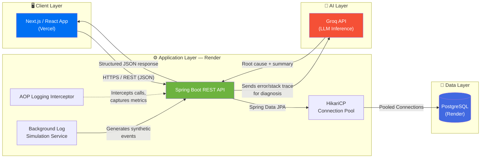

<div align="center">

# 📊 LogPulse — Telemetry & AI Log Analyzer

### Real-time log intelligence for cloud-native applications, powered by LLM diagnostics.
Spring AOP Exception Interception · PostgreSQL · Groq LLM Diagnostics

[](https://log-analyzer-brown.vercel.app/)
[](https://logpulse-api.onrender.com/api/logs)
[](https://openjdk.org/projects/jdk/17/)
[](https://spring.io/projects/spring-boot)
[](https://www.postgresql.org/)
[](https://www.docker.com/)

**[🚀 Live Demo](https://log-analyzer-brown.vercel.app/)** &nbsp;•&nbsp; **[🔌 API Endpoint](https://logpulse-api.onrender.com/api/logs)** &nbsp;•&nbsp; **[📖 API Reference](#-api-reference)** &nbsp;•&nbsp; **[⚙️ Local Setup](#️-local-setup--installation-guide)**

</div>

---

## 📌 Overview

**LogPulse** is a full-stack observability tool that ingests structured application logs in real time and uses **AI (Groq API)** to automatically diagnose root causes — turning raw stack traces and system warnings into human-readable explanations.

### The Problem

Cloud developers routinely lose hours sifting through noisy, unstructured logs to answer a simple question: *"Why did this actually fail?"* Traditional log viewers show you the **what**, but rarely the **why**.

### The Solution

LogPulse bridges that gap by:
- Streaming live, structured logs (`INFO` / `WARN` / `ERROR`) from a simulated production-like backend.
- Feeding error and warning events into an **LLM-powered diagnostic engine** that identifies root causes — connection pool exhaustion, memory pressure, network timeouts, and more.
- Presenting the result in a clean, real-time dashboard — cutting manual triage time from minutes to seconds.

---

## 🏗️ Architecture & Data Flow



**Flow summary:**
1. The **Next.js frontend** (Vercel) polls/fetches the REST API for live log data.
2. The **Spring Boot backend** (Render) serves logs via `GET /api/logs`, backed by **Spring Data JPA + HikariCP** for efficient PostgreSQL connection pooling.
3. An **AOP-based interceptor** captures method-level execution metrics and system events automatically.
4. A **background simulation service** continuously generates realistic log events (transactions, resource spikes, connection issues).
5. When an `ERROR` or critical `WARN` is detected, the backend calls the **Groq API** to generate an AI-driven root cause analysis, which is returned alongside the raw log.

---

## ✨ Key Features

| Feature | Description |
|---|---|
| 🔴 **Real-Time Log Stream** | Live, searchable, and severity-filterable (`ALL` / `INFO` / `WARN` / `ERROR`) feed of structured JSON logs, with timestamp, service, and message payload columns. |
| 🧠 **Automated AI Analysis** | One-click **Run Diagnosis** triggers Groq to analyze recent stack traces and returns a structured **Health Summary → Root Cause Diagnosis → Recommended Immediate Action** breakdown. |
| 🤖 **Automated Log Generation** | A background service continuously simulates realistic system + DB transactional events, plus a manual **Trigger Test Error** button for on-demand demos. |
| 🛡️ **Resilient System Monitoring** | An always-on AOP interceptor status indicator surfaces performance warnings — CPU spikes, worker memory pressure, HikariCP pool timeouts — before they become outages. |

### 📸 Live Demo Screenshot


The dashboard is split into three zones:

- **Top stat bar** — total ingested telemetry count, active PostgreSQL persistence engine, and live AOP interceptor status.
- **Live System Telemetry Stream** (left) — a searchable, filterable (`ALL` / `INFO` / `WARN` / `ERROR`) real-time feed of structured logs with timestamp, severity, service, and message payload columns, plus a **Trigger Test Error** button to simulate failures on demand.
- **Groq AI Diagnosis** (right) — on-demand root cause analysis broken into **Health Summary**, **Root Cause Diagnosis**, and **Recommended Immediate Action**, generated by a single click of **Run Diagnosis**.

> _Add more screenshots/GIFs below (error detail view, mobile view, etc.) as your UI evolves._

---

## 🧰 Tech Stack

<table>
<tr>
<td valign="top" width="25%">

**🎨 Frontend**
- React / Next.js
- Deployed on Vercel
- REST-driven UI

</td>
<td valign="top" width="25%">

**⚙️ Backend**
- Java 17
- Spring Boot
- Spring Data JPA
- HikariCP
- Spring AOP

</td>
<td valign="top" width="25%">

**🧠 AI Engine**
- Groq API
- LLM-based log
  diagnosis & summaries

</td>
<td valign="top" width="25%">

**💾 Database**
- PostgreSQL
- Hosted on Render

</td>
</tr>
<tr>
<td colspan="4" valign="top">

**🚢 DevOps & Infrastructure**
- Docker (Multi-stage builds)
- GitHub Actions (CI)
- Render Web Service (Backend)
- Vercel (Frontend)

</td>
</tr>
</table>

---

## 📡 API Reference

### `GET /api/logs`

Fetches the most recent structured log entries, including AI-generated diagnostics where applicable.

**Base URL:** `https://logpulse-api.onrender.com`

| Method | Endpoint | Description | Auth Required |
|---|---|---|---|
| `GET` | `/api/logs` | Returns a list of recent structured log entries | No |

#### Sample Response

```json
[
  {
    "id": 1042,
    "timestamp": "2026-08-08T09:14:22.531Z",
    "level": "ERROR",
    "source": "PaymentService",
    "message": "Connection to database timed out after 30000ms",
    "stackTrace": "org.springframework.dao.DataAccessResourceFailureException: ...",
    "aiDiagnosis": {
      "rootCause": "HikariCP connection pool exhaustion due to sustained high transaction volume.",
      "recommendation": "Increase maximumPoolSize or investigate long-running queries holding connections.",
      "category": "DATABASE_CONNECTIVITY"
    }
  },
  {
    "id": 1041,
    "timestamp": "2026-08-08T09:13:58.204Z",
    "level": "WARN",
    "source": "SystemMonitor",
    "message": "CPU utilization exceeded 82% on worker-node-2",
    "stackTrace": null,
    "aiDiagnosis": null
  },
  {
    "id": 1040,
    "timestamp": "2026-08-08T09:13:40.912Z",
    "level": "INFO",
    "source": "OrderService",
    "message": "Order #58213 processed successfully",
    "stackTrace": null,
    "aiDiagnosis": null
  }
]
```

#### Response Fields

| Field | Type | Description |
|---|---|---|
| `id` | `number` | Unique log entry identifier |
| `timestamp` | `string (ISO 8601)` | Time the event occurred |
| `level` | `string` | `INFO`, `WARN`, or `ERROR` |
| `source` | `string` | Originating service/component |
| `message` | `string` | Human-readable log message |
| `stackTrace` | `string \| null` | Raw stack trace, if applicable |
| `aiDiagnosis` | `object \| null` | AI-generated root cause analysis (populated for critical events) |

---

## ⚙️ Local Setup & Installation Guide

### Prerequisites

- **Java 17+** and **Maven**
- **Node.js 18+** and **npm/yarn**
- **PostgreSQL** (local instance or Docker container)
- A **Groq API key** ([console.groq.com](https://console.groq.com))

### 1️⃣ Clone the Repository

```bash
git clone https://github.com/<your-username>/logpulse.git
cd logpulse
```

### 2️⃣ Backend Setup (Spring Boot)

```bash
cd backend

# Configure environment variables
export DB_URL=jdbc:postgresql://localhost:5432/logpulse
export DB_USERNAME=postgres
export DB_PASSWORD=your_password
export GROQ_API_KEY=your_groq_api_key

# Run the application
./mvnw spring-boot:run
```

The API will be available at `http://localhost:8080/api/logs`.

**`application.yml` reference:**

```yaml
spring:
  datasource:
    url: ${DB_URL}
    username: ${DB_USERNAME}
    password: ${DB_PASSWORD}
    hikari:
      maximum-pool-size: 10
      connection-timeout: 30000
  jpa:
    hibernate:
      ddl-auto: update

groq:
  api-key: ${GROQ_API_KEY}
  model: llama-3.3-70b-versatile
```

### 3️⃣ Frontend Setup (Next.js)

```bash
cd frontend

# Install dependencies
npm install

# Configure the API base URL
echo "NEXT_PUBLIC_API_URL=http://localhost:8080/api/logs" > .env.local

# Run the dev server
npm run dev
```

Visit `http://localhost:3000` to view the app.

### 4️⃣ (Optional) Run via Docker

```bash
docker build -t logpulse-backend ./backend
docker run -p 8080:8080 --env-file .env logpulse-backend
```

---

## 🚀 Production Deployment & Engineering Challenges Solved

| Challenge | Solution |
|---|---|
| **HikariCP Connection Exhaustion** | Tuned `maximumPoolSize`, `connectionTimeout`, and `idleTimeout` to match Render's free-tier PostgreSQL connection limits, preventing pool starvation under simulated load. |
| **Multi-Stage Docker Builds** | Used a multi-stage `Dockerfile` (Maven build stage → slim JRE runtime stage) to shrink the final image size and speed up Render deployments. |
| **CORS Between Vercel & Render** | Configured explicit `CorsConfigurationSource` in Spring Security to whitelist the Vercel frontend origin, avoiding wildcard `*` origins in production. |
| **Render Cold Starts** | Implemented a lightweight scheduled self-ping (via GitHub Actions cron) to reduce free-tier backend cold-start latency for a smoother demo experience. |
| **AI Latency Management** | Groq API calls are scoped only to `ERROR`/critical `WARN` events (not every log line) to keep response times low and avoid unnecessary token usage. |

### Sample Multi-Stage `Dockerfile`

```dockerfile
# ---- Build Stage ----
FROM maven:3.9-eclipse-temurin-17 AS build
WORKDIR /app
COPY pom.xml .
RUN mvn dependency:go-offline
COPY src ./src
RUN mvn clean package -DskipTests

# ---- Runtime Stage ----
FROM eclipse-temurin:17-jre-alpine
WORKDIR /app
COPY --from=build /app/target/*.jar app.jar
EXPOSE 8080
ENTRYPOINT ["java", "-jar", "app.jar"]
```

---

<div align="center">

### 🔗 Quick Links

**[🌐 Live App](https://log-analyzer-brown.vercel.app/)** &nbsp;|&nbsp; **[⚡ API](https://logpulse-api.onrender.com/api/logs)** &nbsp;|&nbsp; **[🐛 Report an Issue](../../issues)**

Built with ☕ Java, ⚛️ React, and 🧠 AI.

</div>
